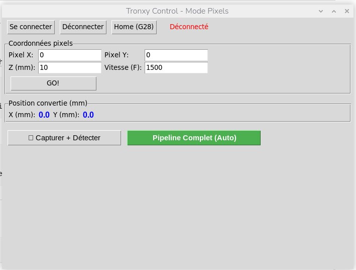
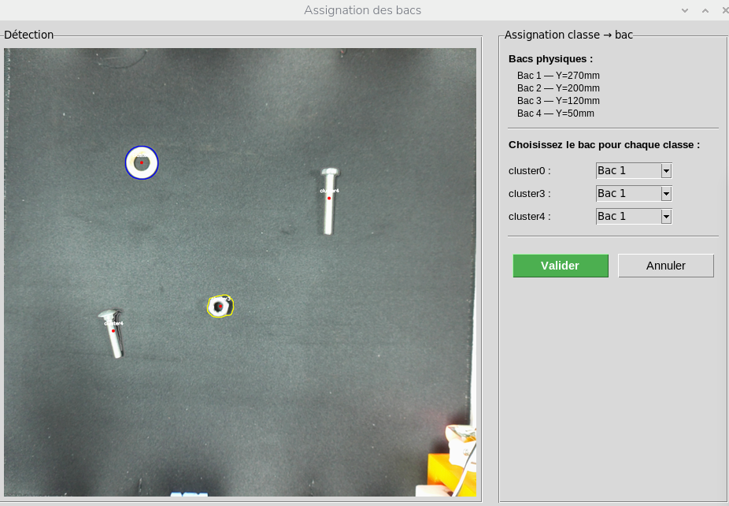

# 🚀 TryAkSys

> Retrofitting a Tronxy X5S 3D printer into a fasteners sorting machine
<p align="center">
  
</p>


## 📋 Project Overview
This project is intended for individuals, organizations, or small businesses in need of a low-cost sorting machine.  
This project is designed to be modular and reproducible, which is why all source files, as well as the STL and SolidWorks files needed to print the mods, are available.
The programm is written in Python, using mainly the libraries PyTorch, scikit-learn, scikit-image, open-cv.

## ✨ Features

- Automated fastener detection and sorting
- Computer vision pipeline for object recognition
- Modular hardware design (3D printable parts)
- Low-cost and reproducible system
- Real-time processing

## 🧠 How it works

1. A camera captures images of fasteners
2. Images are processed using computer vision techniques
3. A machine learning model classifies the objects
4. The system sends commands via serial communication to sort the parts

## 📁 Project Structure

```bash
.
├── 3DPrinting/          # STL and Solidworks files
├── dataset_edge         # Processed dataset used for training
├── Images/              # Illustrations images
├── notebooks/           # Post-Processing tets and experiments
├── src/                 # Source code
├── requirements.txt
└── main.py              # Entry point
```

## ⚙️ Installation & Setup

Follow these steps to set up the development environment on your local machine.

### 1. Clone the repository
```bash
git clone https://github.com/gtritzguden/PI01.git
cd PI01
```
### 2. Install the prerequisties 
OpenCV need to be installed at the system level to make sure GStreamer will work correctly.  
The other dependencies are installed using pip.   
A fully automatic script is provided to facilitate this installation. It creates a virtual environment and install the dependencies.   
```bash
./setup_rpi.sh
```

### 3. Dependencies


| Package        | Version        |
|----------------|---------------|
| joblib         | 1.5.3         |
| numpy          | 2.4.3         |
| Pillow         | 12.1.1        |
| pyserial       | 3.5           |
| scikit-learn   | 1.8.0         |
| scikit-image   | 0.26.0        |
| torch          |               |
| torchvision    |               |
| tqdm           | 4.67.3        |


### 4. Usage
#### Train the model
```bash
python src/train_classifier
```

#### Launch sorting 
- Turn on the printer by pressing the button next to the power cable
- Make sure the printer is connected to the Raspberry Pi5 : the RJ45 cable needs to be plugged in an USB port)
  
```bash
python main.py
```
<p align="center">
  
</p>

Once the GUI has launched, click on **Se connecter**. It allow the communication between the RPI5 and the printer via serial connection
Multiple options then :     
- **Home (G28)** Do a homing
- **Coordonées pixels** Move the printer's to the required position (*x,y* : pixel - *z* : mm - *F* : speed)
- **Capturer + détecter** Launch a detection and a classification whithout sorting
- **Pipeline Complet** Launch a full sorting : detection, classification, pushing fasteners into the bins

By launching **Pipeline Complet** the following step will append : 
- Auto Homing
- Head moving in a corner to let the camera take a photo of the tray
- Auto classification of the detected fasterners

<p align="center">
  
</p>

On this interface, there are the different clusters created and you can select which cluster will go in which bin (different clusters can be put in the same bin)    
Once the selection is made, click on **Valider**    
The sorting machine will then proceed the sorting. It takes a new photo every 3 pieces sorted to ensure the pieces have not moved.

## 👥 Team Members

| Name | Email |
|------|-------|
| Mathieu Brasseur | [mathieu.brasseur@etu.unistra.fr](mailto:mathieu.brasseur@etu.unistra.fr)|
| Mohamed Hamza Choukaili | [choukaili@etu.unistra.fr](mailto:choukaili@etu.unistra.fr) |
| Nicola Di Pietro| [nicola.di-pietro@etu.unistra.fr](mailto:nicola.di-pietro@etu.unistra.fr) |
| Bilal Erraissi| [bilal.erraissi@etu.unistra.fr](mailto:bilal.erraissi@etu.unistra.fr) 
| Guillaume Tritz--Guden | [guillaume.tritz-guden@etu.unistra.fr](mailto:guillaume.tritz-guden@etu.unistra.fr) |
---

> 🚀 Feel free to contact any of us for questions or collaborations!


